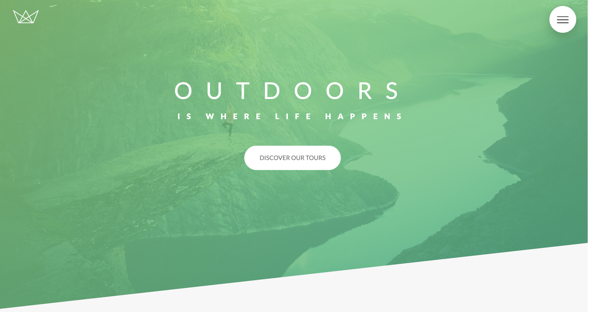

# 🎨 Advanced CSS and Sass Template

## 📌 Overview
This project is a fully responsive and modern **HTML & SCSS** template built as part of the **"Advanced CSS and Sass: Float-based Layouts and More!"** course by Jonas Schmedtmann. It showcases advanced styling techniques using **float-based layouts, clearfix techniques, custom properties, and a modular SCSS architecture**.

## 🔥 Live Demo (click on the picture)
[](https://daniiliev.github.io/Natours/) 


## ✨ Features
✔ **SCSS Architecture** following the **7-1 pattern**  
✔ **Float-based Layout with Clearfix** for structured layouts  
✔ **Custom Animations & Transitions**  
✔ **BEM (Block Element Modifier) methodology** for structured styles  
✔ **Optimized Performance** (minified CSS, reusable components)  
✔ **Modern UI/UX Best Practices**  

## 🛠 Technologies Used
- **HTML5**
- **SCSS (Sass Preprocessor)**
- **Float-based Layout & Clearfix**
- **BEM Methodology**

## 📁 Folder Structure
```
project-folder/
│── index.html        # Main HTML file
│── package.json      # Project dependencies (Sass included)
│── README.md         # Documentation
│
├── scss/             # Main SCSS folder
│   ├── abstract/     # Variables, mixins, functions
│   ├── base/         # Resets, typography, utilities
│   ├── components/   # Buttons, cards, UI elements
│   ├── layout/       # Header, footer, float-based structure
│   ├── pages/        # Page-specific styles
│   ├── themes/       # Dark/light mode styles (if any)
│   ├── vendors/      # Third-party styles
│   ├── main.scss     # Main SCSS file importing everything
│
├── css/              # Compiled CSS output
│   ├── style.css     # Compiled main stylesheet
│   ├── style.css.map # Source map for debugging
│
└── assets/           # Images, fonts, media files
```

## 🚀 Installation & Setup
Follow these steps to get the project running locally:

### 1️⃣ Clone the Repository
```sh
git clone https://github.com/DaniIliev/Natours.git

### 2️⃣ Install Dependencies
Make sure **Node.js** and **npm** are installed, then run:
```sh
npm install
```
This will install **Sass** as a development dependency.

### 3️⃣ Compile SCSS to CSS
Run the following command to compile SCSS files:
```sh
npm run build:css
```

### 4️⃣ Start the Project
If you have a local development server set up, run:
```sh
npm run start
```
Then open `index.html` in your browser.

## 👨‍💻 Author & Credits
This project was created as part of the **"Advanced CSS and Sass: Float-based Layouts and More!"** course by Jonas Schmedtmann.

---
🚀 **Happy Coding!** 🎨✨


